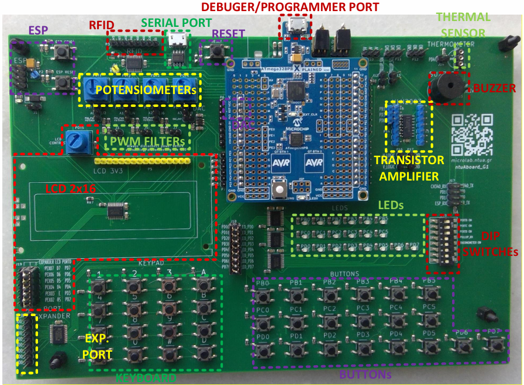

# Microprocessors Lab

This repository contains laboratory exercises developed for the **Microprocessors Lab**
course at the **School of Electrical and Computer Engineering, NTUA**. The labs progress
from basic timing and logic through interrupts, timers, and a range of on-board and
external peripherals, all implemented and tested on real hardware.

## Overview
Eight lab assignments implemented in **AVR Assembly** and **C**, targeting the
**ATmega328PB** microcontroller on the ntuAboard_G1 development board. Topics covered
include programmable delays, boolean logic, external interrupts, timers and PWM, the ADC,
a 2×16 character LCD, the TWI/I²C bus with a PCA9555 port expander, a 4×4 matrix keypad,
the DS18B20 1-wire temperature sensor, and UART-based IoT patient monitoring with an
ESP8266.

*Board: ntuAboard_G1, NTUA Microprocessors Lab.*

## Tools
- **Microchip Studio** - assembling, simulating, and timing the AVR code
- **avr-gcc** - building the C solutions

## Contribution Note
I have included only the exercises that I personally implemented. The remaining exercises
were developed by my lab partner as part of our collaborative work.

## Note on Logic
The exercises use active-low logic, as required by the physical board.
